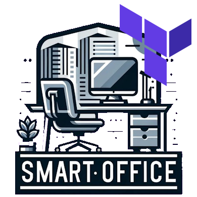

  
  <h1  align="center">Smart Office - Terraform</h1>

This repository contains the Terraform deployment that is required for the provision of the SmartOffice backend services. The various Azure resources required for the deployment of the Smart Office backend are described below.

## Azure Resources

### Azure Resource Groups

The resource group in which all other resources are created. In addition to the main resource group, Azure also automatically creates an infrastructure resource group during deployment, in which the required services and resources for the Azure Kubernetes cluster are provisioned. This resource group is given the name of the main resource group followed by the suffix "-infra".

### Azure Identity

To ensure smooth interaction between the various Azure services and resources, a dedicated  identity is defined that has all the required permissions and role assignments.

### Azure App Configuration

The Azure AppConfiguration in which all configuration settings are stored and then retrieved by the other components of the Smart Office. The following configuration parameters are automatically defined via the deployment:

* **Auth Url**: The authentication endpoint of the identity provider.
* **Client Id**: The OAuth Client Id to be used for authentication against Identity Providers.
* **Connection String**: The connection string used for the connection to the database. This value is loaded directly from the Azure Key Vault via the App Configuration.
* **Frontend Url**: The frontend URL of the Smart Office backend. This endpoint is required for the URL creation of various resources, as the external address within the cluster is not known to the services.
* **Mqtt Hostname**: The hostname under which the Mqtt message broker can be reached.
* **Mqtt Port**: The port under which the Mqtt message broker can be reached.
* **Mqtt Username**: The username to be used for authentication on the Mqtt message broker.
* **Mqtt Password**: The password to be used for authentication on the Mqtt message broker. Similar to the database connection string, this information is also obtained via the Azure Key Vault.

### Key Vault

All sensitive Smart Office configuration data is stored in an Azure Key Vault and retrieved from there via the AppConfiguration app. The microservices of the Smart Office backend therefore only need to know the endpoint of the app configuration. From the perspective of the services, there is therefore no need to differentiate between sensitive and non-sensitive data, as all information is provided centrally via the Azure App Configuration.

### Azure Storage

An Azure file share is defined for the storage of user images, which is subsequently provided in the Azure Kubernetes cluster by the UserImageService as a separate mount point.

### Azure SQL Database

The Smart Office's relational data is housed in a single SQL Server instance, a decision driven by budget considerations. To ensure a clear segregation of the various domains within the Smart Office microservices, individual database schemas have been established for each domain, despite the use of only one database instance for the entire demonstrator.

### Azure Container Registry

The container images of the Smart Office microservices are provided in their own private Azure Container Registry. This ensures that the images are not made publicly available and that only the deployment process has access to them.

### Azure Kubernetes Service

The centerpiece of the Smart Office infrastructure is the Azure Kubernetes cluster. All Smart Office microservices and the Mqtt Message Broker are operated in it.

## Deployment via CI/CD

The deployment of the infrastructure required by the Smart Office backend is carried out via fully automated continuous integration and continuous deployment pipelines. The following set of rules is used:

### Continiouse Integration
The Terraform files are validated as part of the Continiouse Integration Pipeline. This check is carried out for every change for every branch of the Git repository.

### Continiouse Deplyoment 
In the Continiouse Deplyoment Pipeline, the changes are applied to the configured Azure subscription. This takes place immediately after the changes are transferred to the main branch of the Git repository.

